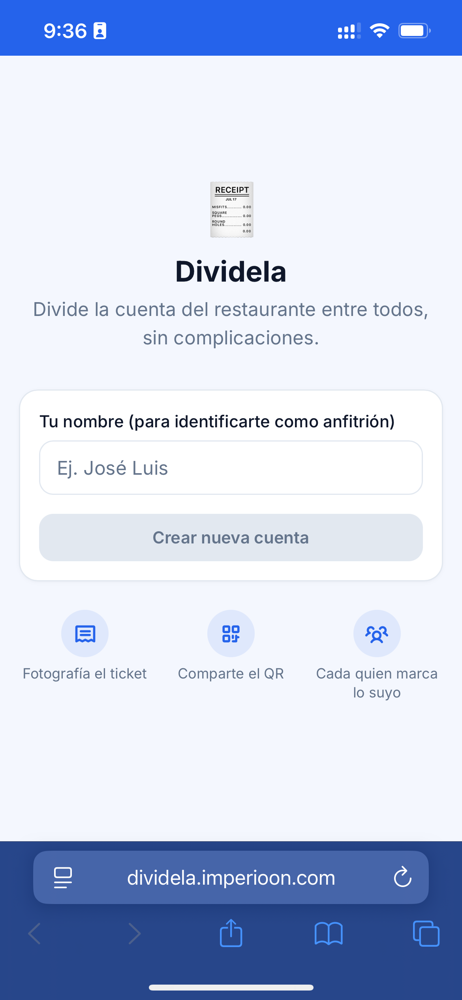
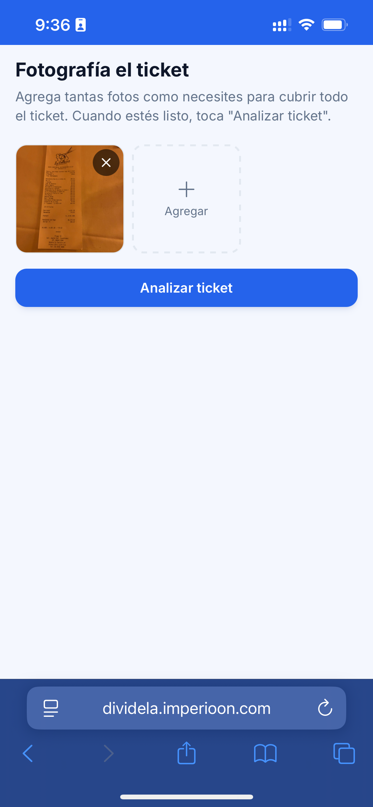
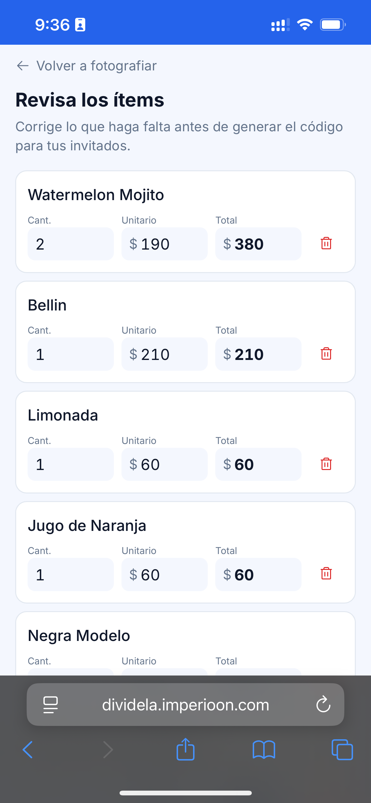
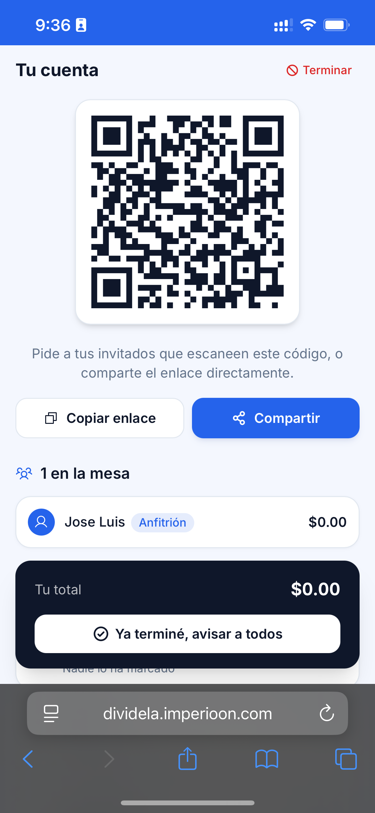
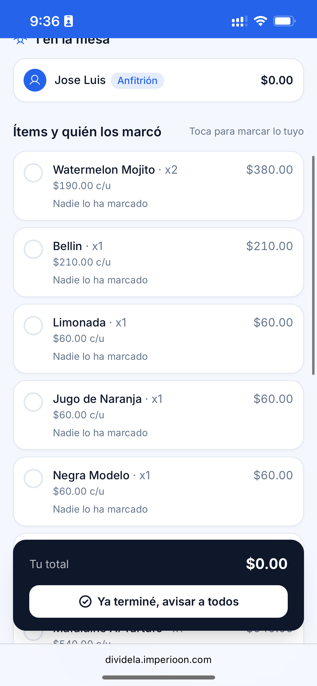
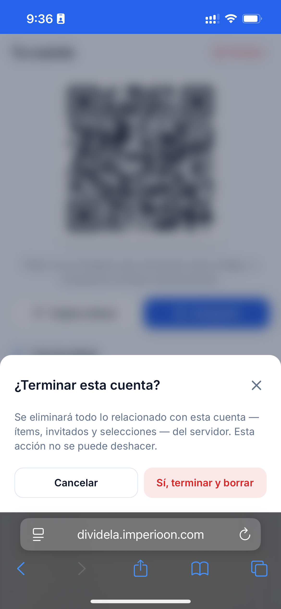

<div align="center">

# 🧾 Dividela

**Divide la cuenta de un restaurante entre todos, sin complicaciones.**

Fotografía el ticket, deja que un modelo de visión lo lea, comparte un código QR y que cada
invitado marque desde su propio teléfono lo que consumió — sin crear cuenta, sin planillas, sin
hacer cuentas a mano.

[](https://react.dev/)
[](https://vitejs.dev/)
[](https://tailwindcss.com/)
[](https://www.framer.com/motion/)
[](https://fastapi.tiangolo.com/)
[](https://www.python.org/)
[](https://www.sqlite.org/)
[](https://docs.docker.com/compose/)
[](LICENSE)

</div>

---

## ✨ Qué hace

1. **El anfitrión fotografía el ticket** — se pueden agregar varias fotos si el ticket es largo;
   todas se analizan **juntas en una sola llamada** a un modelo de visión (vía [OpenRouter](https://openrouter.ai/)),
   que reconstruye la lista de ítems consolidada y sin duplicados, aunque las fotos se traslapen entre sí.
2. **Pantalla de confirmación editable** — el anfitrión corrige nombres, cantidades y precios antes
   de continuar; una alerta (no bloqueante) avisa si la suma no cuadra con el total impreso.
3. **Se genera un código QR** — y también un enlace copiable o compartible directo por WhatsApp/lo
   que sea (Web Share API en iOS) — que abre la sesión para los invitados.
4. **Cada invitado se une con solo su nombre** — sin registro, sin contraseña — y marca lo que
   consumió o los ítems que se compartieron; el costo se divide automáticamente entre quienes los
   marcan. Cada persona tiene un color y un icono asignados de forma estable para identificarse
   de un vistazo, tanto en su propia pantalla como en la del anfitrión.
5. **Todo en tiempo real vía WebSockets**: selecciones, nuevos invitados y el estado "Listo" de
   cada quien se sincronizan al instante entre todos los dispositivos conectados a la sesión, con
   reconexión automática si se cae el wifi del restaurante.
6. **El anfitrión puede marcar lo suyo** y corregir la selección de cualquier invitado desde la
   misma pantalla del QR, sin salir de ahí.
7. **Botón "Listo"** — tanto el anfitrión como cada invitado pueden avisar que ya terminaron de
   marcar lo suyo; en cuanto el 100% de la mesa está listo, un aviso aparece para todos al instante.
8. **Terminar y borrar** — el anfitrión puede cerrar la cuenta en cualquier momento: se elimina por
   completo de la base de datos (ítems, invitados y selecciones) y se avisa en vivo a quien siga
   conectado. No queda nada guardado en el servidor.

## 📸 Capturas

<div align="center">
<table>
<tr>
<td align="center" width="33%"><br/><sub>Inicio — crear cuenta</sub></td>
<td align="center" width="33%"><br/><sub>Fotografía del ticket</sub></td>
<td align="center" width="33%"><br/><sub>Revisión de ítems (OCR)</sub></td>
</tr>
<tr>
<td align="center" width="33%"><br/><sub>Código QR de la sesión</sub></td>
<td align="center" width="33%"><br/><sub>Cada invitado marca lo suyo</sub></td>
<td align="center" width="33%"><br/><sub>Terminar y borrar la cuenta</sub></td>
</tr>
</table>
</div>

## 🖥️ Stack técnico

| Capa | Tecnología |
|---|---|
| Frontend | [React 19](https://react.dev/) + [Vite 6](https://vitejs.dev/) + [Tailwind CSS 4](https://tailwindcss.com/) + [Framer Motion 12](https://www.framer.com/motion/) |
| Iconografía | [Phosphor Icons](https://phosphoricons.com/) |
| Backend | [FastAPI](https://fastapi.tiangolo.com/) + [SQLModel](https://sqlmodel.tiangolo.com/) sobre SQLite |
| Tiempo real | WebSockets nativos de FastAPI |
| Visión / OCR | Modelo de visión vía [OpenRouter](https://openrouter.ai/) (por defecto `google/gemini-2.5-flash-lite`) |
| Contenedores | Docker + Docker Compose (dos servicios, puertos y URLs configurables por `.env`) |
| Despliegue | Pensado para exponerse detrás de un [Cloudflare Tunnel](https://developers.cloudflare.com/cloudflare-one/connections/connect-networks/) |

**Diseño**: sistema visual mobile-first con paleta azul, tipografía Inter, componentes propios
inspirados en un lenguaje de diseño tipo SaaS limpio, y microinteracciones "Apple-feel" (springs,
skeletons, estados vacío/cargando/error, banner discreto de reconexión, `safe-area-inset` para
iPhone con notch/Dynamic Island).

## 🏗️ Arquitectura

```
Dividela/
├── docker-compose.yml        # dos servicios: frontend (nginx) y backend (uvicorn)
├── .env.example               # puertos y URLs base configurables
├── backend/
│   └── app/
│       ├── main.py            # FastAPI app, CORS, WebSocket
│       ├── models.py          # BillSession, Item, Participant, ItemSelection (SQLModel)
│       ├── ocr.py             # llamada multimodal a OpenRouter con todas las fotos del lote
│       ├── ws_manager.py      # difusión de eventos en tiempo real por sesión
│       └── routers/           # sessions, participants, items
└── frontend/
    └── src/
        ├── components/        # Button, Card, Modal, Toast, Avatar, ParticipantsBar, ...
        ├── pages/
        │   ├── host/           # captura de fotos, confirmación de ítems, pantalla del QR
        │   ├── join/           # el invitado se une con su nombre
        │   └── participant/    # el invitado marca lo que consumió
        └── ws/                 # hook de WebSocket con reconexión automática
```

## 🚀 Cómo levantarlo

### Requisitos

- Docker y Docker Compose
- Una API key de [OpenRouter](https://openrouter.ai/) (leer un ticket cuesta una fracción de
  centavo de dólar con el modelo por defecto)

### Local

```bash
git clone https://github.com/JoseLuis0022/Dividela.git
cd Dividela
cp .env.example .env
# Edita .env y coloca tu OPENROUTER_API_KEY
docker compose up --build
```

- Frontend: **http://localhost:5173**
- Backend: **http://localhost:8000** (docs interactivos en `/docs`)

### Detrás de un Cloudflare Tunnel

1. Levanta los contenedores igual que en local — `FRONTEND_PORT`/`BACKEND_PORT` son los puertos
   que le das a `cloudflared` para hacer *forward*.
2. Crea dos subdominios en tu Tunnel, uno por servicio.
3. En `.env`, antes de construir, fija:
   ```env
   FRONTEND_BASE_URL=https://cuenta.tudominio.com
   BACKEND_BASE_URL=https://api-cuenta.tudominio.com
   ```
4. Reconstruye (`docker compose up --build`) — el frontend es estático (Vite + nginx), así que la
   URL del backend se "hornea" en el build; si cambias `BACKEND_BASE_URL` hay que reconstruir esa imagen.

## 🔐 Variables de entorno

| Variable | Descripción | Default |
|---|---|---|
| `FRONTEND_PORT` | Puerto publicado del frontend | `5173` |
| `BACKEND_PORT` | Puerto publicado del backend | `8000` |
| `FRONTEND_BASE_URL` | URL pública del frontend (se usa para armar el link del QR) | `http://localhost:5173` |
| `BACKEND_BASE_URL` | URL pública del backend (build-arg del frontend) | *(vacío → se infiere del hostname)* |
| `OPENROUTER_API_KEY` | API key de OpenRouter | — |
| `OPENROUTER_MODEL` | Modelo de visión a usar | `google/gemini-2.5-flash-lite` |

## 📄 Licencia

[MIT](LICENSE)
